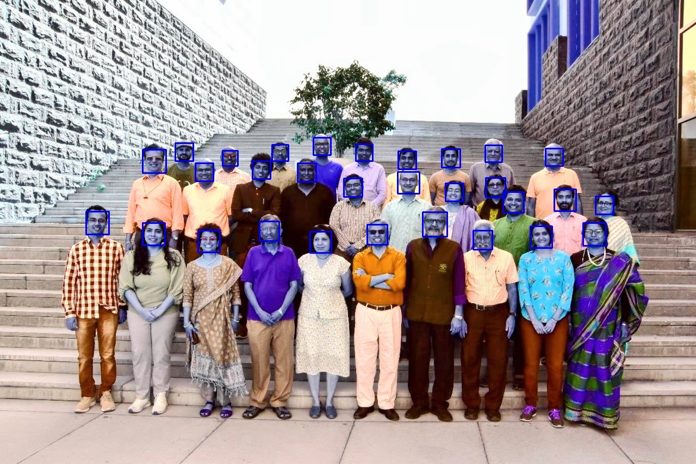
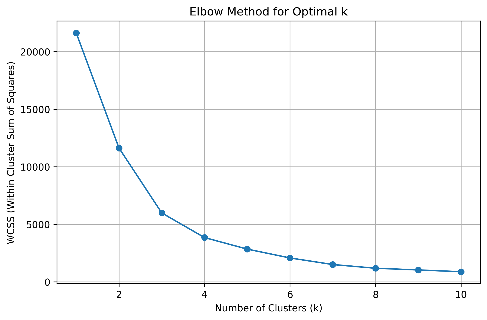

# MLPR - Assignment-5
**Gaganpreet(U20240198)**

## Plots and Outputs

---
## Used Elbow Method to find Optimal K
WCSS values were computed for K = 1 → 10.

### Elbow Plot

---

---
## Methodology
- Used Haar Cascade classifier for face detection
- Converted image to HSV color space
- Extracted Hue and Saturation features from detected faces
- Applied K-Means clustering (k=2)
- Visualized clusters using scatter plots
- Classified a template image using trained model

## Key Findings
- Successfully detected 30 faces from the input image
- Faces were grouped into 2 clusters based on color features
- K-Means effectively separated faces with similar characteristics
- Template image was correctly classified into one cluster

## Results
- Face detection worked efficiently using OpenCV
- Clustering based on HSV features gave meaningful grouping
- Visualization helped understand distribution of clusters

---

# Conclusion
This lab demonstrates how computer vision and clustering techniques (K-means) can be used together to analyze and group facial data effectively.
---

