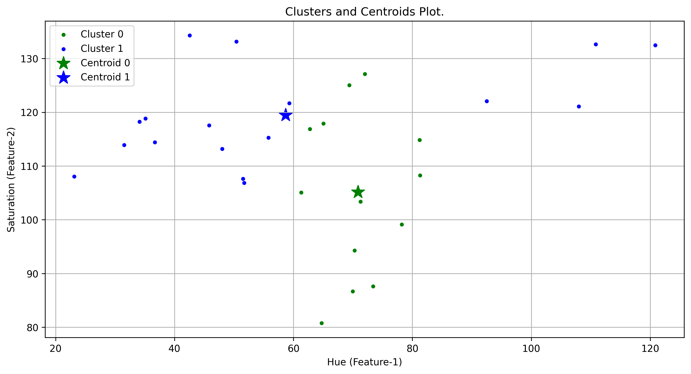
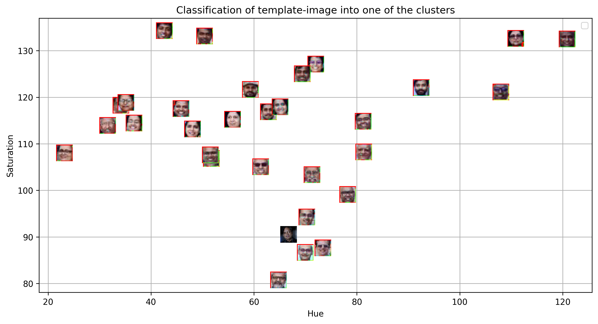

- Each face is plotted in Hue-Saturation space.
- Face thumbnails are displayed as markers.

### Cluster Visualization

---

## 4️⃣ Elbow Method (Optimal K)
WCSS values were computed for K = 1 → 10.

Goal:
- Find the “elbow point” where adding clusters stops giving major improvement.

### Elbow Plot

---

## 5️⃣ Cluster & Centroid Analysis
- Scatter plot shows cluster separation.
- Centroids represent cluster centers.

### Clusters & Centroids

---

## 6️⃣ Template Image Classification
Steps:
- Detect face in template image.
- Extract HSV features.
- Predict cluster using trained K-Means model.

### Template Detection

### Template Cluster Assignment

### Scatter Visualization with Template

---

# 📊 Key Findings
- Hue and Saturation features can effectively separate facial groups.
- K-Means successfully grouped visually similar faces.
- The Elbow Method helped determine a suitable number of clusters.
- Template image classification worked using distance in feature space.

---

# 🧠 Concepts Used
- Haar Cascade Face Detection
- HSV Color Space
- Feature Engineering
- K-Means Clustering
- Elbow Method
- Distance-Based Classification
- Data Visualization with Matplotlib

---

# 📈 Observations
- Smaller K values create broader clusters.
- Larger K values may over-segment data.
- HSV-based features provide consistent grouping across lighting conditions.

---

# ✅ Conclusion
This experiment demonstrates how classical computer vision and unsupervised learning can be combined to perform **face grouping and classification** without deep learning.  
Using HSV features with K-Means provided a simple yet effective pipeline for clustering and assigning new faces into existing categories.

---

# 🚀 Future Improvements
- Use additional features (texture, embeddings).
- Apply PCA for dimensionality reduction.
- Replace Haarcascade with deep learning detectors.
- Experiment with different distance metrics (Cosine, Mahalanobis).

---

# 🛠️ Technologies Used
- Python
- OpenCV
- NumPy
- Matplotlib
- Scikit-learn

---

⭐ *Lab-5: Face Detection & Clustering using Machine Learning*
